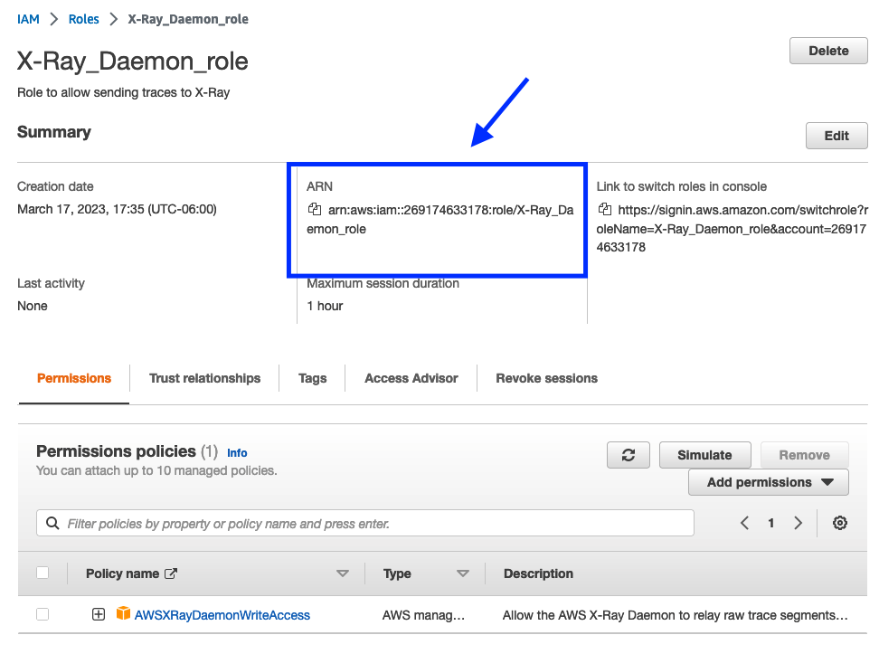

# Instrumenting Go microservices with Gin and AWS X-Ray

In a microservice architecture, operations often span multiple services and resources such as gateways, microservices, load balancers, and databases. The distributed nature of microservices is what makes software instrumentation valuable.

If our code provides traces, metrics, and logs, we can say that it is instrumented, meaning we are able to observe how our system is performing.

Service instrumentation is especially useful for identifying and troubleshooting performance issues and errors. The data collected can also be used for capacity planning by helping us understand the traffic and usage patterns of our applications.

There are several solutions for services instrumentation, such as [OpenTelemetry](https://opentelemetry.io/), [Zipkin](https://zipkin.io/) and [datadog](https://www.datadoghq.com/). AWS also offers an [OpenTelemetry Distro](https://aws-otel.github.io/) to be able to use OpenTelemetry as observability backend while using X-Ray or any other third party solution to receive tracing telemetry data and provide processing, aggregation, and visualizations of that data.

In this post, I'm going to tell you about my experience instrumenting a Go microservice using Gin, with X-Ray.

## Gin

Gin is a lightweight and high-performance web framework for the Go programming language, designed to make it easy to build fast and scalable web applications.

It features a minimalistic API, a robust router, middleware support, and built-in security features, making it an ideal choice for building microservices and other high-performance web applications.

While Gin may have a steep learning curve and limited built-in features, its simplicity and extensibility make it a popular choice for developers who prioritize performance and scalability.

**Creating a gin service from scratch is out of the scope of this post**, but you can read more about gin in the [official documentation page.](https://gin-gonic.com/docs/)

## AWS X-Ray

AWS X-Ray is an AWS service that collects data about requests served by your application and provides tools for viewing, filtering, and gaining insights into that data to identify issues and optimization opportunities.

Some pros of X-Ray over other similar tools are:

* Integration with some AWS services
* No extra infrastructure to manage (daemon included on AWS Elastic Beanstalk and AWS Lambda platforms)
* Can work as a visualizer only (using OpenTelemetry as Tracer)
* For supported services, X-Ray SDK can automatically send and trace request IDs across services
* Managed by AWS
* First 100k traces per month are free
* First 1,000,000 traces retrieved or scanned each month are free.

However, some of its cons are:

* AWS X-Ray can only be used with applications running on Amazon EC2, Amazon EC2 container service, AWS Lambda, and AWS Elastic Beanstalk.
* After exhausting the free traces for the month, every trace indexed or queried has a cost.
* Limited language support: While X-Ray provides SDKs for several programming languages, it doesn't support every language or platform, which may limit its usefulness in certain scenarios.
* Vendor lock-in: Using X-Ray may lead to vendor lock-in with AWS, as it is a proprietary service only available on the AWS platform. This may limit your ability to switch to other cloud providers or tools in the future.

If, after reading some of the pros and cons, you are still inclined to use X-Ray, then you can continue reading.

### Requirements

To view trace information in AWS, you need an AWS account and an application running on AWS infrastructure or integrated with AWS services. In addition, you'll need:

* An instance of the X-Ray daemon, which can be run as a binary or as a Docker container. You can find detailed instructions on how to run and configure it [here](https://docs.aws.amazon.com/xray/latest/devguide/xray-daemon-local.html). For this article, I'll be using the OS X binary.
* Your application must have the necessary permissions to interact with AWS X-Ray service and other AWS services that it uses.

#### IAM Role
To enable your application to send traces to X-Ray, you need to provide the X-Ray daemon with a role. To create the role, go to the "Roles" section in the AWS Web Console for the IAM service and click on the "Create Role" button.


In the wizard, select "AWS Account" for Trusted Entity and click "Next". On the next screen, search for the permissions policy named "AWSXRayDaemonWriteAccess". Click "Next" to proceed.


Add a name and description for the role, and then click "Create Role". This will take you back to the roles list. Look for the role you just created to view and copy the role ARN.



### X-Ray Daemon

Now that we've created the daemon role, let's configure and run it.

For my local setup, I only needed to change a few settings, such as the log level, setting the local mode to true, and adding the X-Ray role and the AWS region.

Here's the config file I used:

```yaml
# Send segments to AWS X-Ray service in a specific region
Region: "us-west-2"
Socket:
  # Change the address and port on which the daemon listens for UDP packets containing segment documents.
  UDPAddress: "127.0.0.1:2000"
  # Change the address and port on which the daemon listens for HTTP requests to proxy to AWS X-Ray.
  TCPAddress: "127.0.0.1:2000"
Logging:
  # Change the log level, from most verbose to least: dev, debug, info, warn, error, prod (default).
  LogLevel: "dev"
# Turn on local mode to skip EC2 instance metadata check.
LocalMode: true
# Assume an IAM role to upload segments to a different account.
RoleARN: "arn:aws:iam::269174633178:role/X-Ray_Daemon_role"
# Daemon configuration file format version.
Version: 2
```

You can learn more about other config values in the [AWS X-Ray Developer Guide.](https://docs.aws.amazon.com/xray/latest/devguide/xray-daemon-configuration.html)

### Instrumenting your Go microservice.

Now that we have the X-Ray daemon configured and running, we can add instrumentation to our service.

AWS recommends to start by tracing incoming requests by wrapping the service handlers with `xray.Handler`. However, since we are using Gin, the approach we'll implement is slightly different.

While looking for resources about how to instrument a gin application, I found this [middleware by Oroshnivskyy](https://github.com/oroshnivskyy/go-gin-aws-x-ray) which is based in the [x-ray handler function](https://github.com/aws/aws-xray-sdk-go/blob/1e154184282bb3b0166cb1b154f2b4abed0b1e6f/xray/handler.go#L99).

This middleware will start and close a segment for every request received. It also, will take care of handling the trace ID header (`"x-amzn-trace-id"`), which is a header that contains an ID value that will be generated for each new request and will be propagated across all of our microservices.

So let's add the middleware to the routes we want to instrument:

```go
// as part of my gin routes
v1.GET("/auth/roles", xraymid.Middleware(xray.NewFixedSegmentNamer("GetRoles")), controller.GetRoles)
```

Here, we are adding the (aliased as xraymid) x-ray gin middleware to a route of the group `v1`. The value passed as argument to `NewFixedSegmentNamer` must be set to a descriptive name for your route. This will be the name of the main trace group for this endpoint.

Alright! now let's see if it works! Start the service and verify the Daemon is running.

After making a request, we can see the in the daemon logs something like:
```
2023-03-21T13:10:47-06:00 [Debug] Received request on HTTP Proxy server : /GetSamplingRules
2023-03-21T13:10:48-06:00 [Debug] processor: sending partial batch
2023-03-21T13:10:48-06:00 [Debug] processor: segment batch size: 1. capacity: 50
2023-03-21T13:10:48-06:00 [Info] Successfully sent batch of 1 segments (0.109 seconds)
2023-03-21T13:10:49-06:00 [Debug] Send 1 telemetry record(s)
```

It looks like it's working! Let's see the trace in the AWS web console.

In your AWS web console, go to CloudWatch and in the side panel, look for X-Ray and click on the "traces" option.

If everything went well, you'll see the number of recently received traces, and the traces table will be populated with such traces.


In the traces table, click in an entry. We'll be taken to the trace view, were we can see the traced information.


Here we can see the trace data. We only are creating a segment and closing it for each call, so we don't have much other data, but we can see the response status code, the time it took for the request to be served, and, of course, the trace map, which for now includes only the client and the service.

#### Creating sub segments
So now that we have our basic instrumentation setup, what else can we trace?

As of now, we are only tracing a request and some of its metadata. But what if we want to be more granular?

Let's say we have an intensive process running as part of the request; we can add a subsegment to monitor it.

Somewhere in my service, the following code is executed when I call the `auth/roles` endpoint:

```go
// inside a function
roles := make([]Role, len(rolesList))
for i, roleItem := range rolesList {
	role, err := u.buildRole(roleItem)
	if err != nil {
		return model.RoleList{}, err
	}
	roles[i] = role
}
```

We can wrap the `for` loop in a subsegment so we can see how much of the request time is spent in this process.

To add a subsegment, we wrap the loop as:
```go
err = xray.Capture(ctx, "BuildRolesDetail", func(ctx1 context.Context) error {
	for i, roleItem := range rolesList {
		role, err := u.buildRole(roleItem)
		if err != nil {
			return err
		}
		roles[i] = role
	}
	if err = xray.AddMetadata(ctx1, "No. roles built", len(roles)); err != nil {
		return nepErrors.InternalServerError.WithDetail(err.Error())
	}
	return nil
})
```

Let's run our service and call again our instrumented endpoint.

This is the new trace in AWS CloudWatch -> Traces:


Now we see that the request took **215ms**, and of those, the `BuildRolesDetail` loop took **205ms**.

Are you starting to think about the tracing posibilities? You should! You can use `xray.AddMetadata` to add any extra information you need. Just take into consideration that X-Ray Daemon only sends to [AWS up to 64KB of metadata per Segment](https://docs.aws.amazon.com/xray/latest/devguide/xray-api-segmentdocuments.html).

### Instrumenting AWS Clients with X-Ray

Instrumenting AWS clients using the SDK-V1 is fairly simple, you can follow the [official guide](https://docs.aws.amazon.com/xray/latest/devguide/xray-sdk-go-awssdkclients.html).

There isn't much documentation about how to instrument AWS SDK-v2 clients, but the configuration is also simple.

Somewhere in your service code, you'll be initializing your AWS client(s). To add instrumentation to them, you just need to provide the clients with an X-Ray HTTP client and pass the request context along for every call.

```go
cfg, err := config.LoadDefaultConfig(ctx)
if err != nil {
	return nil, err
}

// Create an HTTP client
httpClient := &http.Client{}

// Set the HTTP client as the AWS configuration's HTTP client
cfg.HTTPClient = httpClient

// Create an X-Ray client
xrayClient := xray.Client(httpClient)

dynamoClient := dynamodb.NewFromConfig(cfg, func(options *dynamodb.Options) {
	// Wrap the http.Client with an xray.Client
	options.HTTPClient = xrayClient
})
```

Here, I'm adding the X-Ray HTTP Client to the AWS DynamoDB Client.

Let's call again our instrumented endpoint.


I'm currently running DynamoDB locally, but you can already see how much time is spent per call to DynamoDB. We can also see that the Trace Map has been updated to show my local instance of DynamoDB.


## Takeaways
Instrumenting a service with X-Ray is relatively simple, but it can get complex really fast depending on the things we want to monitor. Because of this, the effort to add tracing to your service might vary based on your use case.

Another thing to consider is the 64KB limit per segment. It might not be enough if you want to trace lots of subsegments or add more metadata. There are ways to circumvent this, but they are out of the scope of this post.

In conclusion, implementing X-Ray in a Go microservice is a straightforward process that can greatly benefit your application's observability and troubleshooting capabilities. The integration process is relatively easy, and the X-Ray SDK provides a range of useful features that make it easy to trace requests and identify bottlenecks. However, it's important to keep in mind that X-Ray does have some drawbacks, such as the cost associated with using it and the limitations of its sampling capabilities.

Nonetheless, with careful consideration and proper implementation, X-Ray can be an invaluable tool for debugging and optimizing your microservices architecture. So don't hesitate to give it a try and see how it can enhance the performance and reliability of your Go microservices.